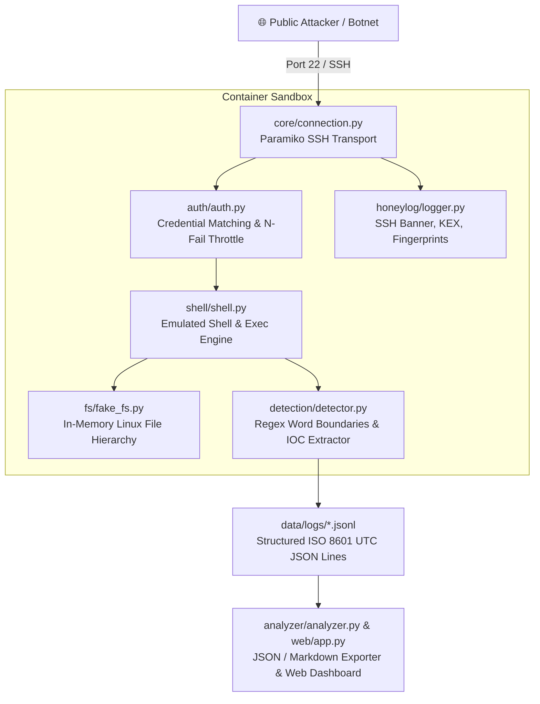

# 📖 Sentinel SSH — Complete Technical Documentation & Interview Guide

This document provides a comprehensive, module-by-module architectural deep dive, security threat model explanation, and interview preparation guide for **Sentinel SSH**.

---

## 🎯 1. Executive Summary & Project Pitch

> **30-Second Elevator Pitch**:
> *"Sentinel SSH is a modular, high-interaction-feel SSH honeypot built in Python using Paramiko, containerized with Docker. Deployed on a public VPS hardened with Tailscale VPN, it captures real-world attacker brute-force credentials, terminal command history, and payload URLs. It features an in-memory emulated Linux filesystem so no attacker code ever executes on the host, and a threat detection engine that maps commands directly to **MITRE ATT&CK® techniques** while automatically extracting Indicators of Compromise (IOCs) into structured JSON telemetry for SIEM ingestion."*

---

## 💡 2. Innovations & Competitive Differentiation

Unlike standard open-source honeypots (like basic Cowrie setups or simple scripts), Sentinel SSH implements **4 key technical innovations**:

### 1. 🧠 Adaptive $N$-Fail Threshold Authentication Engine
* **Problem**: Standard honeypots only accept fixed credential pairs (e.g. `root/root`). If a botnet tries `root/P@ssword123!`, standard honeypots reject it and lose all post-login malware payloads.
* **Sentinel Innovation**: Tracks failure count per IP address in memory (`IP_FAIL_COUNTS`). After 3 failed attempts, access is granted regardless of password, tricking botnet scanners into executing their full post-exploitation command chains.

### 2. 🛡️ 100% Zero-Trust In-Memory Pure Python Emulation
* **Problem**: Proxying commands into restricted containers or subshells risks container breakouts or resource exhaustion (fork bombs).
* **Sentinel Innovation**: Zero native OS execution (`subprocess`, `os.system`, `eval`, `exec`). Commands like `wget` and `curl` only extract URL strings into log fields without opening outbound network sockets.

### 3. ⚡ Word-Boundary Threat Detector & Real-Time IOC Parser
* **Sentinel Innovation**: Applies regex rules with strict word boundaries (`\b`) to eliminate false positives (e.g. matching `cat /etc/passwd` without triggering on `concat`). Automatically maps commands to **MITRE ATT&CK® IDs** (`T1105`, `T1082`, `T1053.005`, `T1098.004`, `T1070.004`) and extracts URLs, IPs, and cryptographic file hashes into structured JSON log fields.

### 4. 🔐 Dual-Homing Tailscale VPN Host Protection Architecture
* **Sentinel Innovation**: Public port 22 is exposed exclusively to the isolated Docker honeypot. The real host management SSH server (`sshd`) is moved to port 22222 and bound **strictly to a private WireGuard/Tailscale VPN mesh interface** (`100.x.y.z`). Administrative access is completely hidden from public internet scanners.

---

## 🏛️ 3. System Architecture & Component Mapping

---

## 🔍 4. Module-by-Module Technical Deep Dive

### 📡 `core/connection.py` — SSH Transport & Telemetry Core
* Implements Paramiko `ServerInterface`.
* Intercepts `remote_version` (e.g. `SSH-2.0-Go-SSH-Client`), KEX proposals, public key fingerprints, and PTY terminal dimensions.
* Enforces `MAX_GLOBAL_CONNECTIONS` (50) and `MAX_PER_IP_CONNECTIONS` (5) to resist Denial of Service (DoS) floods.

### 🔑 `auth/auth.py` — Authentication & Throttling
* Evaluates credentials against `COMMON_CREDENTIALS` list (`root/root`, `admin/admin123`).
* Maintains `IP_FAIL_COUNTS` dictionary. Increments failure count per IP until threshold `ALLOW_ANY_AFTER_N_FAILS` (3) is reached, granting entry on attempt 3.
* Logs every authentication attempt (successful or failed) to `audits.jsonl`.

### 📁 `fs/fake_fs.py` — Virtual Linux Filesystem
* `FakeFSNode` class represents files and directories in memory.
* Pre-populates realistic paths (`/proc/cpuinfo`, `/proc/meminfo`, `/etc/passwd`, `/etc/os-release`, `/tmp`, `/root`).
* Supports stateful mutation (`mkdir`, `touch`, `rm`, `chmod`, and pipe redirection `>` and `>>`).

### 💻 `shell/shell.py` — Emulated Shell & Command Handler
* `split_command_line()` splits compound commands (`uname -a; whoami && id`).
* Emulates output for 20+ utilities (`uname`, `ps`, `free`, `df`, `w`, `lscpu`, `whoami`, `id`, `chmod`, `wget`, `curl`, `tftp`).
* Manages interactive PTY sessions (`emulated_shell`) and non-interactive execution mode (`handle_exec_mode`).

### ⚡ `detection/detector.py` — Threat Detector & IOC Extractor
* Word boundary regex rules (`\b`) mapped to **MITRE ATT&CK®**:
  - `download_execute` (`T1105`): `wget`, `curl`, `tftp`, `lwp-download`
  - `persistence` (`T1053.005`, `T1098.004`): `crontab`, `/etc/cron.*`, `authorized_keys`
  - `defense_evasion` (`T1070.004`): `rm -rf /var/log`, `history -c`, `unset HISTFILE`
  - `reconnaissance` (`T1082`, `T1083`): `uname`, `lscpu`, `cat /proc/cpuinfo`
* `extract_iocs()` automatically parses URLs, IPv4/IPv6 addresses, domain names, and MD5/SHA256 file hashes.

### 📄 `honeylog/logger.py` — JSON Lines Telemetry System
* Uses Python `RotatingFileHandler` (10MB per file, 5 backups).
* UTC ISO 8601 timestamps (`YYYY-MM-DDTHH:MM:SS.ffffff+00:00`).
* Rotates `.jsonl` log files: `audits.jsonl`, `cmd_audits.jsonl`, `alerts.jsonl`.

### 📊 `analyzer/analyzer.py` — Analytics Engine
* Aggregates session counts, unique attacker IPs, top credential pairs, command frequencies, threat categories, and IOC summaries.
* Exports machine-readable JSON (`analytics_report.json`) and publication-ready Markdown (`analytics_report.md`).

---

## ❓ 5. Top Interview Questions & Answers

### Q1: "How did you ensure attackers cannot escape the honeypot?"
> **Answer**: *"Safety is built into 3 layers: (1) Zero native execution — no `subprocess`, `os.system`, `eval`, or `exec`; (2) Container network isolation via `internal: true`; (3) Non-root user execution inside Docker with `cap_drop: ALL` and `no-new-privileges` enabled."*

### Q2: "How do you protect your host management SSH daemon?"
> **Answer**: *"I implemented Tailscale VPN dual-homing. Real host SSH (`sshd`) is moved to port 22222 and bound strictly to the private Tailscale VPN IP (`100.x.y.z`) with password authentication disabled. Public port 22 is assigned exclusively to the honeypot container."*

### Q3: "How does your threat detector map commands to MITRE ATT&CK®?"
> **Answer**: *"I built regex rules with strict word boundaries (`\b`) to avoid false positives. Commands like `wget` map to `T1105` (Ingress Tool Transfer), `crontab` maps to `T1053.005` (Cron Persistence), and `rm -rf /var/log` maps to `T1070.004` (Indicator Removal)."*

---

## 📚 6. Technical Terminology Cheat Sheet

| Term | Project Definition |
|---|---|
| **TTPs** | *Tactics, Techniques, and Procedures* — Attacker behaviors categorized via MITRE ATT&CK. |
| **IOCs** | *Indicators of Compromise* — Malicious URLs, IPs, domains, and cryptographic file hashes parsed from commands. |
| **SIEM Ingestion** | Formatting logs as single-line JSON (`.jsonl`) ready for Elasticsearch, Splunk, or AWS OpenSearch. |
| **Defense-in-Depth** | Combining in-memory Python emulation + non-root Docker container + `internal: true` network isolation. |
| **KEX Telemetry** | Capturing SSH Key Exchange algorithm proposals and client version strings to identify botnet toolkits. |
